# GPX-EDL System Knowledge Graph

This document preserves the conversation-derived architecture without redesigning the committed constitutional specification.

## Operational flow

```mermaid
flowchart LR
    Runner --> SourcePlatform["Source Platform"]
    SourcePlatform --> APRA
    APRA --> EnvoyScout["Envoy / SCOUT"]
    EnvoyScout --> Zeta
    Zeta --> ScoutStage["SCOUT-STAGE"]
    ScoutStage --> Verification
    Verification --> PromotionDataFrame["Promotion DataFrame"]
    PromotionDataFrame --> DiplomatMara["Diplomat / Mara"]
    DiplomatMara --> Liaison
```

## Disk branch

```mermaid
flowchart LR
    DiskDefinition["Disk Definition"] --> Validate
    Validate --> ResolveTaxonomies["Resolve Taxonomies"]
    ResolveTaxonomies --> AssignRings["Assign Rings"]
    AssignRings --> ApplyPolicies["Apply Policies"]
    ApplyPolicies --> CompileMachinePayload["Compile Machine Payload"]
    CompileMachinePayload --> EmitDiskCartridge["Emit Disk Cartridge"]
    EmitDiskCartridge --> RunnerExecution["Runner Execution"]
```

## Frozen rules

- Every runner owns exactly one Source Platform.
- Recruiters are architecturally equivalent to Indeed.
- APRA terminates at the first authoritative application authority.
- Zeta is a Hiring Ecosystem Gap Detector, not a coverage engine.
- Nearby locations of one employer count as one investigation.
- Company-targeted disks are created only after Zeta discovers the employer.
- NAICS classification is mandatory before disk creation.
- The dataframe is accumulated incrementally through Runner, APRA, and Zeta.
- Human dispositions are Promote, Form Disk, Reject Error, Reject No Error, and Pending or Standby.
- Zeta ends after 15 qualifying results or exhausted search space.
